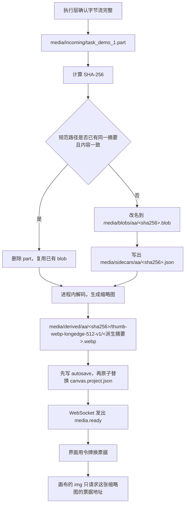

# 媒体工程与运行形态

本文只规定本机怎么跑、工程目录怎么放、媒体字节落在哪、密钥放在哪，以及无人引用的文件怎么回收。节点怎么拖、连线手势怎么做、提示词怎么编译，不在这里设计。

这是一个从零开始的本地应用。撰写本文时，工作区里没有本应用的源码模块，不能把任何已有目录当成后端或媒体库来扩展。`eval/infinite-canvas-src` 是另一份外部画布源码：其 `README.md` 开头写明该项目已停更，并写有著作权和禁止擅自商业封装的说明。本文不引用它的目录、接口或实现。

本文里的超时、边长、并发和人周都是选定的设计值或判断区间，不是在这台机器上测出来的性能。云厂商的真实请求报文也不在这里编造。执行领域若要接某个厂商，另写适配器，并在本机对照文档核实。

## 结论

第一版的运行形态是：用户在本机浏览器里打开界面，本机再跑一个只监听 `127.0.0.1` 的后端进程。后端负责工程文件、媒体库、ffmpeg、任务库落盘、密钥，并代理本机 ComfyUI，避免浏览器直接跨域访问 ComfyUI。现在不做 Electron，也不做 Tauri。

用户的一份工程是一个文件夹。原始字节按 SHA-256 放进这个文件夹，工程 JSON 只记正斜杠相对路径和参数，不嵌二进制，也不含 API Key。画布上的图片用缩略图；视频另外有时长、首帧、尾帧、封面和代理文件，画布上的播放器只拿代理，不拿原片。ffmpeg 只做探测、抽帧和转代理，不改原片，也不负责生成模型。

密钥写入 Windows 凭据库。超过凭据库单条上限时，才改用当前用户的 DPAPI 文件，文件放在应用数据目录，仍然不进工程目录。无人引用的媒体不在当次会话里立刻删除；下次打开工程时先隔离到回收站，满 7 天后才物理删除。

## 1. 进程、启动和访问控制

### 1.1 有哪些进程

第一版同时存在的进程只有下面这些，不要把它们包进一个桌面壳：

| 进程 | 谁启动 | 做什么 | 不做什么 |
| --- | --- | --- | --- |
| 浏览器标签页 | 人打开终端打印出的地址 | 画布界面。通过同源的 HTTP 和 WebSocket 访问后端 | 不直接读磁盘，不调用 ffmpeg，不保存密钥，不直接请求 ComfyUI |
| 后端 `canvas-backend` | 人在开发机上手动启动 | 工程、媒体、ffmpeg、任务库落盘、密钥、ComfyUI 反向代理 | 不内嵌浏览器，不安装 ComfyUI，不加载模型 |
| ComfyUI | 人按 ComfyUI 自己的方式启动 | 本地生成。本应用只通过它的 HTTP API 使用配方 | 不是本仓库的子模块。计算节点不进入用户工程 |
| ffmpeg / ffprobe | 后端按需拉起，用参数数组，不经过 `cmd /c` | 探测、抽帧、转代理 | 不下载，不生成画面，不改原片 |

后端用 TypeScript，跑在 Node.js 上。这样工程文件的类型可以和浏览器共用同一份 `packages/project-schema`。本应用不导入 ComfyUI 的 Python 进程，所以第一版不把后端写成 Python。撰写本文时在开发机上执行了 `node --version` 和 `npm --version`，结果是 Node `v24.19.0`、npm `11.17.0`。后端按这条已安装的 Node 来开发即可，不要再引入第二套运行时。同一时刻执行的 `command -v ffmpeg` 和 `command -v ffprobe` 都没有找到可执行文件，输出分别是 `ffmpeg-not-found` 和 `ffprobe-not-found`。因此第一版必须把「没装 ffmpeg」当成普通状态，而不是启动失败。

ComfyUI 的提交、历史、取图、上传、打断、队列和进度消息归执行领域。那些路径要对照本机安装的 ComfyUI 版本核实。媒体层不自己拼这些 URL，也不保存任何云厂商报文。

### 1.2 监听地址

默认监听 `127.0.0.1:8787`。`8787` 只是选定的默认端口，撰写时没有检查它是否被占用。端口可用配置或命令行改掉。

启动时如果端口已被占用，进程退出，并在终端写：`端口 8787 已被占用。如果画布后端已经在运行，请打开原来的地址；否则换一个端口再启动。` 不要杀掉占用者。

默认拒绝绑定 `0.0.0.0` 和其他网卡地址。本机应用的工程和密钥都在这台电脑上，没有「顺手开到局域网」的第一版需求。若以后确要给局域网用，必须是单独的显式开关，并在终端写明风险。第一版不要做这个开关。

`Host` 头只接受 `127.0.0.1:<实际端口>` 和 `localhost:<实际端口>`。其他 Host 一律拒绝。这是为了挡住把域名重新解析到本机的一类请求。本文没有做渗透测试，落地时要保留这个检查，不要为了方便代理把它删掉。

### 1.3 开发启动和演示启动

两套启动方式，界面代码是同一套。

开发时开两个终端：

1. 后端：`node apps/backend/dist/main.js --host 127.0.0.1 --port 8787`
2. 前端开发服务器：只监听 `127.0.0.1:5173`，把 `/api` 和 `/ws` 代理到 `8787`。浏览器只打开 `http://127.0.0.1:5173/#token=<一次性令牌>`。

`5173` 同样只是选定的默认值。代理是否原样转发头，撰写时没有跑过 Vite，实现后要用「浏览器能出缩略图、另一来源的网页拿不到令牌」做一次手工确认。

可演示的切片不依赖开发服务器。后端加上 `--serve-web apps/web/dist` 后，浏览器只打开 `http://127.0.0.1:8787/#token=<一次性令牌>`。打包好的静态文件由后端发出。这仍然是浏览器加后端，不是桌面壳，也不是双击就能开的纯静态页。

数据目录默认是 `%LOCALAPPDATA%\CanvasApp`。若环境变量 `LOCALAPPDATA` 不存在，后端启动失败，并写：`找不到本机应用数据目录，后端没有启动。` 不要改把数据写到程序旁边。

每次启动生成新的会话令牌：32 字节随机数，编码成十六进制。令牌写入 `%LOCALAPPDATA%\CanvasApp\session.token`，并打印带片段标识符的地址。片段标识符不会随 HTTP 请求发出。页面脚本读取它，放进 `sessionStorage`，之后的变更请求带 `Authorization: Bearer <令牌>`。

除了下面两个匿名入口，所有项目、媒体票据、密钥和配置接口都要令牌：

- `GET /health` 只返回状态枚举，不返回绝对路径、用户名、令牌或密钥。
- 静态界面文件，仅在 `--serve-web` 时提供。

令牌错误或后端已重启时，返回 `401`，正文是：`后端已经重新启动，请从终端里的新地址打开。` 响应里不要带新令牌。

变更请求还要检查来源：`Origin` 必须是 `http://127.0.0.1:5173`、`http://localhost:5173`、`http://127.0.0.1:8787` 或 `http://localhost:8787` 之一，并且和实际端口匹配。没有 `Origin` 的变更请求拒绝。不要把请求里的 `Origin` 反射回去。

媒体字节不走 `Authorization` 头，因为画布上的 `` 和 `<video>` 加不了自定义头。页面用令牌调用 `POST /api/projects/current/media-tickets`，换回 `GET /api/media-ticket/<ticketId>`。票据是服务端内存里的随机标识，只对应签发时记下的那一个相对路径，有效期选为 10 分钟。地址里不放路径，调用方改 URL 也不能换成另一个文件。响应要支持 `Range`，否则视频无法拖动进度。票据过期返回 `403`，正文是：`预览地址已过期。` 正在发送中的响应不要中途掐断；播放器失败后由界面重新要票据并回到原时间，这个重试归画布领域。访问日志要丢掉票据标识，也不要记录 `Authorization` 和 `Cookie`。

这套访问控制是按本机威胁写的拟定方案，本文没有做渗透测试。

### 1.4 单实例

应用数据目录里放 `locks/backend.lock`，内容是进程号。启动时若锁里的进程还在，就退出并写：`已经有一个后端在运行。请打开原来的地址，不要启动第二个。` 若进程号已经不存在，可以接过锁。不要用固定全局互斥名以外的隐蔽手段。两个后端同时写同一个工程目录会造成媒体库损坏，所以第一版不允许。

一个后端进程同一时刻只打开一个工程。用户要打开另一个工程时，先保存当前工程，再切换。不做多工程并行，避免媒体路由串到错误的根目录。

### 1.5 健康检查

`GET /health` 的形状：

```json
{
  "ok": true,
  "ffmpeg": "missing",
  "ffprobe": "missing",
  "ffmpegVersion": null,
  "comfy": "unconfigured",
  "secretStore": "not-checked"
}
```

`ffmpeg` 和 `ffprobe` 取 `missing` 或 `ok`。`ffmpegVersion` 只有在启动时跑过 `ffmpeg -version` 才填写，禁止写死一个没在这台机器上见过的版本号。`comfy` 取 `unconfigured`、`reachable` 或 `unreachable`。检查 ComfyUI 时只访问配置里的那一个基址，超时选为 2 秒；这是选定的等待上限，不是测得的响应时间。`secretStore` 不要在健康检查里真的去读密钥。

界面上的状态条文案：

- ffmpeg 缺失：`这台电脑还没有 ffmpeg。图片预览仍可使用；视频只能保存原片，不能生成封面和播放用的预览。`
- ComfyUI 未配置：`还没有填写本机 ComfyUI 地址。`
- ComfyUI 不可达：`本机 ComfyUI 没有连上。生成暂时不可用，已经打开的工程和媒体不受影响。`

后端不自动安装、也不自动启动 ComfyUI。

### 1.6 后端模块边界

建议的代码布局如下。本文不创建这些目录，也不初始化仓库。

```text
apps/
  web/                         浏览器界面。渲染选型归画布领域
  backend/
    src/
      main.ts                  监听地址、单实例锁、令牌、静态文件
      http/                    路由和票据
      project/                 工程 JSON 的校验、原子保存、打开恢复
      media/                   哈希、入库、派生、回收
      secrets/                 SecretStore；Windows 实现与内存假实现
      proxy/                   只把 /api/comfy 转到配置好的那一个基址
      tasks/                   任务日志的追加和脱敏。状态机归执行领域
packages/
  project-schema/              前后端共用的工程文件类型
  media-recipes/               recipeId 常量
```

`/api/comfy/*` 只转发到应用配置里的 `comfyBaseUrl`。客户端不能在请求里另给一个目标 URL，否则这个端口会变成开放代理。转发时去掉浏览器带来的 `Cookie` 和 `Authorization`，避免把本应用的会话令牌送到 ComfyUI。

## 2. 三套目录不要混

### 2.1 应用数据目录

位置：`%LOCALAPPDATA%\CanvasApp\`。这里的东西属于这台电脑、当前 Windows 用户，不随工程文件夹拷走。

```text
%LOCALAPPDATA%\CanvasApp\
  app.json                本机配置。可以有绝对路径
  session.token           本次启动的会话令牌
  locks\
    backend.lock
  logs\                   运行日志。要脱敏
  secrets\                只有超长密钥的 DPAPI 密文才会出现在这里
```

`app.json` 的字段：

```ts
interface AppConfig {
  configVersion: 1;
  /** 例如 http://127.0.0.1:8188。null 表示还没填。不是密钥。 */
  comfyBaseUrl: string | null;
  /** null 表示从 PATH 查找。撰写时这台机器的 PATH 里没有 ffmpeg。 */
  ffmpegPath: string | null;
  ffprobePath: string | null;
  listenHost: "127.0.0.1";
  listenPort: number;
  /** 选定的起始默认，没有调优过。 */
  ffmpegConcurrency: 1;
  imageDecodeConcurrency: 2;
  /** 单个入库文件的上限。选定值，不是测出来的容量。 */
  maxIngestBytes: number; // 2 * 1024 * 1024 * 1024
  /** ffmpeg 单次运行的安全上限，到点就杀进程。不是测得的转码时长。 */
  ffmpegMaxRunMs: number; // 30 * 60 * 1000
  recentProjects: RecentProject[];
}

interface RecentProject {
  projectId: string;
  name: string;
  /** 只允许出现在应用数据里。 */
  absolutePath: string;
  lastOpenedAt: string;
}
```

最近工程若路径已经不存在，列表仍保留，并标成「路径不存在」。不要悄悄删掉，免得用户以为工程被清掉了。

日志记任务标识、相对路径和状态，不记提示词正文，不记密钥，不记令牌。上游如果把密钥回在错误正文里，写入日志前先打掉。本文不规定各厂商错误正文的形状。

### 2.2 用户工程目录

用户选定或新建的文件夹就是一份工程。拷贝整个文件夹就能把作品和媒体带走。密钥、会话、最近列表和本机 ComfyUI 地址不在里面。

```text
<工程文件夹>/
  canvas.project.json
  canvas.project.json.bak
  canvas.project.autosave.json
  media/
    incoming/
      <taskId>.part
      <taskId>.meta.json
    blobs/
      <sha256 前两位>/
        <sha256 六十四位小写十六进制>.blob
    sidecars/
      <sha256 前两位>/
        <sha256>.json
    derived/
      <sha256 前两位>/
        <源 sha256>/
          <recipeId>/
            <派生文件 sha256>.<ext>
            <派生文件 sha256>.json
    pins.json
    trash/
      <隔离批次标识>/
        ...被移走的 blob、sidecar 和 derived
  tasks/
    journal.jsonl
    queue.json
```

示例只说明形状。下面的哈希是 64 个 `a` 和 64 个 `b`，不是某次真实生成的摘要。

```text
media/blobs/aa/aaaaaaaaaaaaaaaaaaaaaaaaaaaaaaaaaaaaaaaaaaaaaaaaaaaaaaaaaaaaaaaa.blob
media/sidecars/aa/aaaaaaaaaaaaaaaaaaaaaaaaaaaaaaaaaaaaaaaaaaaaaaaaaaaaaaaaaaaaaaaa.json
media/derived/aa/aaaaaaaaaaaaaaaaaaaaaaaaaaaaaaaaaaaaaaaaaaaaaaaaaaaaaaaaaaaaaaaa/thumb-webp-longedge-512-v1/bbbbbbbbbbbbbbbbbbbbbbbbbbbbbbbbbbbbbbbbbbbbbbbbbbbbbbbbbbbbbbbb.webp
```

选择「每个工程自带一份媒体」是故意的。跨工程按哈希去重会让拷走的文件夹缺文件，所以第一版不做全局媒体池。两份工程里即使字节相同，也各存一份。

`tasks/` 是任务库的落点，状态机归执行领域。约束是：日志和队列里不准出现密钥、绝对路径、`data:` 内嵌媒体，也不准把二进制贴进 JSON。媒体结果只记 SHA-256 和相对路径。`journal.jsonl` 是 UTF-8，一行一条，每条追加后刷盘，崩溃最多丢掉正在写的那一行。

不要把日志、会话令牌或密钥放进工程目录。工程目录里唯一的二进制是 `media/` 下的原始文件和派生文件。

### 2.3 新建和打开

新建时，后端调用 Windows 文件夹对话框，让用户选父目录，再在其中创建工程文件夹。对话框由后端进程弹出，因为浏览器选中的目录句柄到不了后端的文件系统。本文没有在这台机器上调用过文件夹对话框。对话框打不开时，界面允许粘贴一个路径。

工程名要按 Windows 文件名规则过滤：不准包含 `\ / : * ? " < > |`，不准是保留设备名 `CON`、`PRN`、`AUX`、`NUL`、`COM1` 到 `COM9`、`LPT1` 到 `LPT9`，也不准以点或空格结尾。这些是平台命名规则，落地时对照微软的文件命名说明核实；本文没有逐个创建这些名字做实验。

拒绝把磁盘根目录、用户主目录、应用数据目录本身当作工程文件夹。文案：`请另外选一个文件夹来放工程，不要直接用磁盘根目录或用户主目录。` 同名文件夹已存在时：`这个位置已经有同名文件夹，请换一个名字。`

打开工程只把绝对路径写入 `app.json` 的最近列表。`canvas.project.json` 里仍然只有相对路径。

第一版打开工程的方式就是打开这个文件夹。不另做安装包式的「工程数据库」。

## 3. 相对路径

工程内所有引用都是相对工程根的正斜杠路径，例如 `media/blobs/aa/<sha256>.blob`。开发机是 Windows，也不例外。保存前把反斜杠当成错误拒绝，不要悄悄改成正斜杠再写入，否则调用方会一直产生错误分隔符。

规范路径由哈希算出来，不由调用方随便起名：

```ts
function blobRelPath(sha256: string): string {
  return `media/blobs/${sha256.slice(0, 2)}/${sha256}.blob`;
}

function derivedRelPath(sourceSha256: string, recipeId: string, derivativeSha256: string, ext: string): string {
  return `media/derived/${sourceSha256.slice(0, 2)}/${sourceSha256}/${recipeId}/${derivativeSha256}.${ext}`;
}
```

`sha256` 必须是 64 位小写十六进制。`recipeId` 只允许 `[a-z0-9.-]+`。Windows 文件系统不区分大小写，所以禁止再写一份大写哈希，避免两个名字指向同一文件。

解析时全部拒绝：

- 空路径、绝对路径、盘符、以 `/` 或 `\\` 开头
- 任何 `..`、`.`、空片段、双斜杠
- 片段里出现 `:`（挡住盘符和 NTFS 备用数据流）、`NUL` 字符
- 规范化之后不在工程根里面的路径
- 真实路径跳出工程根的符号链接或目录联接

写入前对目标的父目录做同样的真实路径检查。若工程里已经有指向外部的链接，停止写入，文案：`工程目录里有指向外部的链接，已停止写入媒体库。` 读取时如果正式文件的真实路径在工程外，不要把字节发给浏览器，按「文件不可用」处理，并隔离该条目。

发给浏览器的永远是票据 URL，不是 `file://`，也不是盘符路径。后端调用 ffmpeg 时把相对路径变成系统路径放进参数数组，但这个系统路径不准写回工程 JSON。

路径很长时，Windows 传统 `MAX_PATH` 可能让打开失败。后端在 Windows 上对实际系统调用使用 `\\?\` 长路径前缀。工程 JSON 里仍然只存短的相对路径。本文没有在这台机器上用超长路径做过实验。写失败时保留 `incoming` 里的临时文件，文案：`磁盘写入失败，结果没有进入媒体库。临时文件还留着，可以重试保存。`

## 4. 工程文件字段草案

文件是 UTF-8、无 BOM 的 JSON，扩展名固定为 `canvas.project.json`。第一版每次保存写整份文档，不写二进制补丁日志。大工程保存会花多久，本文没有测量。若以后太慢，再改存储，不要在第一版做两套写法。

类型由 `packages/project-schema` 定义，前后端共用。下面的草案里，节点语义、脏标记何时置位、新版本何时产生，归产品领域；能力参数和配方标识的含义归执行领域。媒体层负责这些字段能被校验、原子写盘、并参与回收时的引用扫描。冲突时以已定边界为准：变体留在节点内的变体数组里，汇合用有序槽，工程文件不含密钥和二进制。

```ts
interface CanvasProjectFile {
  format: "canvas-project";
  formatVersion: 1;
  /** 创建时生成的 UUID。拷贝文件夹不会改它。本机用「打开的绝对路径」区分两份拷贝，不用这个字段当互斥键。 */
  projectId: string;
  name: string;
  createdAt: string; // ISO-8601 UTC
  updatedAt: string;
  writtenByAppVersion: string;
  viewport: { x: number; y: number; zoom: number };
  nodes: ProjectNode[];
  edges: ProjectEdge[];
  /** 只有非密钥的工程级默认值。 */
  generationDefaults: { secretRefs: SecretRef[] };
}

interface SecretRef {
  /** 小写短名，例如 cloud.image.primary。不是密钥，也不是某厂商真实报文里的字段。 */
  providerId: string;
  /** 同一提供方的第几把钥匙。默认 "default"。 */
  account: string;
}

interface ProjectNode {
  nodeId: string;
  /** text 是用户写下的文本。generation 是一次生成。image / video / audio 是已经落到媒体上的结果节点。 */
  kind: "text" | "image" | "video" | "audio" | "generation";
  x: number;
  y: number;
  width: number;
  height: number;
  title: string;
  /** 产品领域决定何时为 true。媒体层保存这个值，但不因为媒体写完就去跑下游。 */
  stale: boolean;
  text: TextBody | null;
  primary: NodeOutput | null;
  /** 变体默认在这里。用户把变体拖成新节点之前，不要另建节点。拖出的手势归画布领域。 */
  variants: NodeOutput[];
  /** 有序汇合槽。order 从 0 连续。第一版一个槽只有一条边。 */
  inputSlots: InputSlot[];
  capability: CapabilityBinding | null;
  error: UserError | null;
}

interface TextBody {
  /** 选定上限 1 MiB。超过则 value 为空，字节进 text-file 媒体。这是格式限制，不是测量值。 */
  value: string;
  media: MediaPointer | null;
}

type SlotRole =
  | "prompt"
  | "reference-image"
  | "first-frame"
  | "last-frame"
  | "style-reference"
  | "character-reference"
  | "mask"
  | "audio-reference";

interface InputSlot {
  slotId: string;
  order: number;
  role: SlotRole;
  edgeId: string | null;
}

interface ProjectEdge {
  edgeId: string;
  fromNodeId: string;
  fromPort: "primary" | "variant";
  fromVariantId: string | null;
  toNodeId: string;
  toSlotId: string;
  role: SlotRole;
}

interface CapabilityBinding {
  capabilityId:
    | "image.from-text"
    | "image.from-image"
    | "image.with-references"
    | "video.from-image"
    | "video.from-text" // 只留接口，第一刀不实现
    | "video.lipsync" // 只留接口，第一刀不实现
    | "text.generate"; // 只留接口。第一刀的「文本」是文本节点，不是已排期的语言模型
  backend: "comfy-local" | "cloud";
  providerId: string;
  /** 配方标识。ComfyUI 侧指向 API 格式配方，不是 KSampler / VAE 计算图。 */
  recipeId: string | null;
  /** 非密钥参数。禁止的键名见后文。 */
  params: Record<string, string | number | boolean | null>;
  secretRef: SecretRef | null;
}

type MediaViewStatus =
  | "empty"
  | "saving"
  | "deriving"
  | "ready"
  | "partial"
  | "failed"
  | "missing";

interface NodeOutput {
  outputId: string;
  versionId: string;
  producedByTaskId: string | null;
  createdAt: string;
  status: MediaViewStatus;
  media: MediaPointer | null;
  warnings: UserError[];
  error: UserError | null;
}

interface MediaPointer {
  sha256: string;
  byteSize: number;
  mimeDetected: string;
  kind: "image" | "video" | "audio" | "text-file";
  /** 必须等于 blobRelPath(sha256)。 */
  relPath: string;
  originalFileName: string | null;
  width: number | null;
  height: number | null;
  /** 图片为 null。视频和音频用毫秒整数。探测到的原始小数字符串放 sidecar，不放这里。 */
  durationMs: number | null;
  hasAudio: boolean | null;
  /** 尾帧在 ffmpeg 行为被本机核实之前保持 unverified。 */
  frameAccuracy: "not-applicable" | "unverified";
  derivatives: {
    thumb: DerivativePointer | null;
    poster: DerivativePointer | null;
    proxy: DerivativePointer | null;
    firstFrame: DerivativePointer | null;
    lastFrame: DerivativePointer | null;
  };
}

interface DerivativePointer {
  recipeId: string;
  sha256: string;
  byteSize: number;
  mime: string;
  relPath: string;
  status: "ready" | "failed";
  error: UserError | null;
}

interface UserError {
  code: string;
  /** 给用户看的完整句子。 */
  userMessage: string;
  /** 可含相对路径。不准含密钥、令牌、绝对路径。 */
  detail: string | null;
}
```

参考图不一定要占用 `image.with-references` 这个能力标识。若产品和执行领域把参考图并进图生图，可以不使用该标识，但槽位角色 `reference-image` 必须留下。遮罩就是普通图片，角色记在槽上，不要另造一种媒体容器。

一次成功文生图写进工程后，相关片段应像这样。哈希和标识都是示例：

```json
{
  "format": "canvas-project",
  "formatVersion": 1,
  "projectId": "00000000-0000-4000-8000-000000000001",
  "name": "示例工程",
  "nodes": [
    {
      "nodeId": "node_text_1",
      "kind": "text",
      "stale": false,
      "text": { "value": "一只纸船", "media": null },
      "primary": null,
      "variants": [],
      "inputSlots": [],
      "capability": null
    },
    {
      "nodeId": "node_gen_1",
      "kind": "generation",
      "stale": false,
      "primary": {
        "outputId": "out_1",
        "versionId": "ver_1",
        "producedByTaskId": "task_demo_1",
        "status": "ready",
        "media": {
          "sha256": "aaaaaaaaaaaaaaaaaaaaaaaaaaaaaaaaaaaaaaaaaaaaaaaaaaaaaaaaaaaaaaaa",
          "byteSize": 123456,
          "mimeDetected": "image/png",
          "kind": "image",
          "relPath": "media/blobs/aa/aaaaaaaaaaaaaaaaaaaaaaaaaaaaaaaaaaaaaaaaaaaaaaaaaaaaaaaaaaaaaaaa.blob",
          "width": 1024,
          "height": 1024,
          "durationMs": null,
          "hasAudio": null,
          "frameAccuracy": "not-applicable",
          "derivatives": {
            "thumb": {
              "recipeId": "thumb-webp-longedge-512-v1",
              "sha256": "bbbbbbbbbbbbbbbbbbbbbbbbbbbbbbbbbbbbbbbbbbbbbbbbbbbbbbbbbbbbbbbb",
              "mime": "image/webp",
              "relPath": "media/derived/aa/aaaaaaaaaaaaaaaaaaaaaaaaaaaaaaaaaaaaaaaaaaaaaaaaaaaaaaaaaaaaaaaa/thumb-webp-longedge-512-v1/bbbbbbbbbbbbbbbbbbbbbbbbbbbbbbbbbbbbbbbbbbbbbbbbbbbbbbbbbbbbbbbb.webp",
              "status": "ready"
            },
            "poster": null,
            "proxy": null,
            "firstFrame": null,
            "lastFrame": null
          }
        },
        "warnings": [],
        "error": null
      },
      "variants": [],
      "capability": {
        "capabilityId": "image.from-text",
        "backend": "comfy-local",
        "providerId": "comfy-local",
        "recipeId": "recipe-image-from-text-v1",
        "params": { "seed": 1 },
        "secretRef": null
      }
    }
  ]
}
```

这个 JSON 不是 ComfyUI 或任何云厂商的请求体，也不能拿去当工作流。`recipeId` 如何映射到 API 格式工作流，归执行领域。

保存时递归检查键名。出现下列键就拒绝整次保存：`apiKey`、`api_key`、`apikey`、`authorization`、`secret`、`secretKey`、`secret_key`、`accessToken`、`refreshToken`、`token`、`password`、`bearer`。比较时忽略大小写，并且只匹配完整键名，不扫描提示词句子。任何字符串若以 `data:image/`、`data:video/`、`data:audio/` 或 `data:application/` 开头，也拒绝。除了 `text.value` 单独允许到 1 MiB 以外，其他字符串超过 256 KiB 就拒绝。拒绝文案：`工程没有保存：里面包含密钥或内嵌的媒体数据。密钥请写到系统凭据库，图片和视频会单独放进媒体库。`

坐标、尺寸、缩放必须是有限数字。否则：`工程里有无法保存的数字，这次没有写入磁盘。`

`formatVersion` 大于后端认识的版本时，不要打开，也不要回收：`这个工程是由更新的版本创建的，当前程序打不开它。` 第一版没有旧文件可迁移。以后若要迁移，先把原文件复制到旁边，迁移完成后再替换；失败则原文件保持不动。

同一 `versionId` 若已经提交过一份哈希，又收到另一份不同字节，保留先写入的那一份，节点错误为：`同一次结果出现了两份不同的内容，已保留先保存成功的那一份。`

变体被拖成新节点时，新节点的 `primary.media` 复制同一份 `sha256` 和 `relPath`，不复制字节。删除其中一个节点只减少引用。字节是否还要，等回收规则判断。

## 5. 内容寻址媒体库

原始字节的标识就是内容的 SHA-256。文件名是哈希，不使用用户给的扩展名。用户看到的原名放在 `originalFileName`，只用于展示。

侧车文件 `media/sidecars/<分片>/<sha256>.json`：

```ts
interface BlobSidecar {
  sha256: string;
  byteSize: number;
  mimeDetected: string;
  kind: "image" | "video" | "audio" | "text-file" | "unknown";
  originalFileName: string | null;
  importedAt: string;
  source: "import" | "generation";
  taskId: string | null;
  sniff: { matched: boolean; magic: string | null };
  /** ffprobe 返回的时长原文。没有跑过探测则为 null。 */
  durationRaw: string | null;
}
```

第一版允许预览的魔数：PNG、JPEG、WebP、GIF、MP4、WebM、WAV、MP3、FLAC。GIF 只取第一帧做静止缩略图，画布不播放动画。SVG 直接拒绝：`第一版不接收 SVG。` 魔数和声明不一致时，以魔数为准；认不出魔数就把 `kind` 记为 `unknown`，字节仍然按哈希保存，节点进入 `failed`。

入库函数只接受「已经在本机、并且调用方声明流已经完整」的字节。媒体层不根据外网 URL 自己去下载，避免这里变成云厂商客户端。执行层在同一后端进程里，用自己的 HTTP 客户端把 ComfyUI 或云适配器的字节写进 `media/incoming/<taskId>.part`。流没有完整结束就不许提交。半截文件的文案：`结果不完整，没有写入媒体库。` 临时文件留在 `incoming`，可以重试。重试由用户触发，不自动重跑生成。

单个文件超过 `maxIngestBytes`（默认 2 GiB）时拒绝：`单个文件超过 2 GiB，第一版不接收。` 已经写下的半截临时文件删掉，因为已知不接收，不存在「留着再提交」的意义。

提交顺序固定如下。任一步崩溃，都不许先改掉唯一一份字节。

1. 把完整字节写在 `media/incoming/<taskId>.part`。同卷上的临时文件才挪得动。
2. 边写边算 SHA-256。同时记录字节数。
3. 若规范路径上已经有同一哈希，核对已有文件的大小和摘要。一致则删除这次的 `.part`，复用已有文件。不一致则不要覆盖已有文件，把这次的文件留在 `incoming`，节点失败：`媒体库里已有的文件和摘要对不上，新结果没有覆盖它。`
4. 否则把 `.part` 挪到 `media/blobs/.../<sha256>.blob`。用同一目录内的改名，不要先删目标再改名。
5. 写出侧车。侧车也是先写临时文件再改名。
6. 进入派生。图片缩略图或视频封面、代理完成后，再写派生指针。
7. 立刻把带新媒体指针的文档写入 `canvas.project.autosave.json`，再按第 11 节的方式替换正式工程文件。生成结果的指针不准只留在内存里等下一次防抖。

磁盘满：错误码 `media/disk-full`，文案 `磁盘已满，结果没有写入媒体库。腾出空间后可以重试保存，生成不会自动重跑。` 临时文件能留则留。

Windows 上杀毒软件可能短暂锁住新文件，导致改名返回占用。对同一次改名做有限次退避重试；仍然失败则保留 `.part`，文案：`文件已经下载，但移不进媒体库，可能被其他程序占用。可以重试保存。` 不要删掉这份临时文件。

派生文件同样先写临时文件，算好派生字节的 SHA-256，再挪到「配方加派生哈希」的路径。禁止在同一路径上覆盖旧派生文件。配方改了就用新的 `recipeId`，旧文件自然变成无人引用。这样浏览器可以对票据响应使用长期缓存：缓存键是不可变的派生哈希。只有 `status` 为 `ready` 的派生文件才允许这样缓存。

图片的 PNG、JPEG、WebP 用进程内解码库生成缩略图，不要为每张图启动 ffmpeg。具体依赖在开发机上安装成功后再定版本；撰写时没有安装图片解码库。若该库装不上，图片节点进入 `partial` 或 `failed`，不准改成「画布直接显示原图」来掩盖失败。原图 URL 仍然可以给检查器在近景或下载时使用，那是画布领域的选择，不是缩略图失败时的自动替身。

本机生成并发为 1，由 ComfyUI 自己的队列保证，执行领域负责不并行提交第二个本地任务。媒体派生是另一条队列：同时只跑 1 个 ffmpeg，图片解码同时最多 2 个。这两个数字是 `app.json` 里的起始默认，没有调优过。派生可以和「下一次」本地生成在时间上重叠，但重叠不等于两个 ComfyUI 任务并行。云端并发另算，多个云端结果可以同时下载；真正把文件挪进哈希路径时，按工程加一把锁，同一哈希串行提交。下载并行度的起始默认也是 2。

文本节点的文字留在 JSON 里。只有超过 1 MiB 的文本才入库为 `text-file`。该文件必须能按 UTF-8 解码，否则：`文本文件不是 UTF-8，没有放进节点。` 字节仍按哈希保留，供用户稍后处理。音频在第一刀没有界面。类型里留下 `audio`，是为了以后的参考音频不用改文件格式。音频不走视频代理。

## 6. 一张图从生成完成到出现在画布上

这里说的是文生图或图生图的一张图。视频在下一节另表列出，不把视频当成大图片。



对应的用户可见状态：

| 时机 | `status` | 用户看到的句子 |
| --- | --- | --- |
| 字节还在写入 `incoming` | `saving` | 正在保存结果 |
| 原件已落盘，缩略图还在做 | `deriving` | 正在生成预览 |
| 缩略图已写入并记入工程 | `ready` | 不额外弹成功框，节点上出现预览 |
| 原件在，缩略图失败 | `partial` | 图片已保存，但预览没有生成 |
| 字节没有可靠落盘 | `failed` | 结果没有写入媒体库 |
| 打开工程时路径不在 | `missing` | 找不到这个文件 |

`media.ready` 事件只携带节点、输出版本，以及三个用途不同的地址种类，不携带盘符：

```ts
interface MediaReadyEvent {
  nodeId: string;
  outputId: string;
  versionId: string;
  status: "ready" | "partial";
  previewTicketPath: string | null; // 图片缩略图或视频封面一类的静止图
  playbackTicketPath: string | null; // 只有视频代理，图片永远是 null
  originalAvailable: boolean; // 为 true 时检查器可以再去换原件票据
}
```

画布在远景用色块、近景才换更清晰的图，这个切换归画布领域。媒体层保证 `ready` 的图片一定有缩略图票据；近景若要原图，必须显式再要原件票据，不能把缩略图失败偷偷换成原图。

用户从系统里拖进一张参考图，走同一条入库，`source` 记为 `import`。连线只是边，不复制字节。执行层要把这张图交给 ComfyUI 时，通过媒体层按哈希读取字节，再由执行层自己上传。上传格式不在本文编造。

## 7. 缩略图、封面、首尾帧、代理

派生配方是路径的一部分。下面的边长、质量和编码器参数都是拟定的，不是画质评测结果。落地时可以改参数，但必须换新的 `recipeId`，不要让旧文件的含义漂移。

| 配方标识 | 用于 | 拟定参数 |
| --- | --- | --- |
| `thumb-webp-longedge-512-v1` | 图片缩略图；视频小预览 | 长边最多 512，不放大，WebP。编码质量参数选 80，这是编码器参数，不是评测分数 |
| `poster-webp-longedge-1280-v1` | 视频封面 | 由首帧静止图缩小，长边最多 1280，不放大，WebP |
| `frame-png-native-v1` | 首帧和尾帧各一份 | PNG，保持探测到的原始分辨率，不缩小 |
| `proxy-h264-longedge-1280-v1` | 画布播放 | MP4，H.264，长边最多 1280，宽高都变成偶数，`yuv420p`，`+faststart`。有音轨则再转 AAC。CRF 选 23，preset 选 `veryfast`，这是编码器参数 |

图片节点只需要 `thumb`。视频节点需要时长、首帧、尾帧、封面和代理五类信息；时长写在 `MediaPointer.durationMs`，其余是派生文件。

视频状态怎么判定：

- `ready`：原件已落盘，并且缩略图、封面、首帧、尾帧、代理全部 `ready`。
- `partial`：原件已落盘，但上面任意一项失败。画布可以显示已经成功的那张静止图。`playbackTicketPath` 只有代理成功才非空。
- 缩略图成功、代理失败：用户看到静止图，句子是 `原片已保存，但现在不能在画布里播放。`
- 封面失败但缩略图成功：仍然可以显示小预览，句子是 `封面没有生成。`
- 首帧或尾帧失败：句子是 `原片已保存，但没有得到首帧或尾帧。` 禁止用缩小后的封面冒充首帧去填下一次生成的槽。执行层见到首帧指针失败或缺失时，应拒绝把它当作首帧输入。
- 代理的画面成功、声音失败：代理文件改为无声再保存，节点可以播放，警告是 `预览里没有声音，原片已保存。` 这仍算 `partial`，因为和原片不一样。不要悄悄把有声原片交给画布播放器。

音频节点第一版没有派生文件。参考音频的波形以后若要做，用新配方 `waveform-json-v1`，现在不产生这个文件。

打开视频原件只提供两种动作：下载，或「用系统播放器打开」。后者由后端按已解析的、确认在工程内的路径调用系统打开，不经过壳。失败文案：`系统没有打开这个文件。` 这个动作不是画布里的 `<video>`。

## 8. ffmpeg 做什么、不做什么

撰写本文时，开发机上没有 ffmpeg 和 ffprobe。下面的命令是拟定调用，没有在本机执行过。实现时要用本机安装到的版本逐条核实；核实之前，`frameAccuracy` 保持 `unverified`，界面不承诺尾帧就是精确的最后一帧。

后端从 `app.json` 的路径或 `PATH` 查找可执行文件。找不到时，图片入库和缩略图照常进行；视频原件仍然按哈希保存，派生全部失败，节点为 `partial`，文案：`原片已保存，但这台电脑没有可用的 ffmpeg，画布不能播放。安装 ffmpeg 后，可以只重新生成预览。` 「重新生成预览」只重跑派生，不重新向模型要一次视频。

ffmpeg 要做的：

- 用 ffprobe 读宽度、高度、时长、是否有音轨、视频和音频编码。时长原文进侧车，毫秒整数进工程文件。做不到帧级精确，就不要在界面写「精确时长」。
- 抽首帧，作为全分辨率 PNG。
- 抽尾帧，作为另一份全分辨率 PNG。在核实之前，尾帧只当近似结果。
- 把首帧交给图片解码库做成缩略图和封面。封面不要再调用一次 ffmpeg，除非图片库失败。
- 转出播放用代理。即使原片已经是较小的 H.264 MP4，第一版仍然转成这份配方，让画布只有一条播放路径。代价是多占磁盘和时间，这是取舍，不是测量结论。
- 用户取消预览、或达到 `ffmpegMaxRunMs` 时杀掉 ffmpeg 进程。超时文案：`预览生成超时，原片已保存。可以重试预览，不会重新生成视频。` 取消文案：`已取消预览生成。原片还在。`

ffmpeg 不做的：

- 不生成、不放大、不补帧、不对口型、不拼接镜头、不做时间线剪辑。
- 不改原始字节。原件必须和入库时的摘要一致。重新编码只发生在派生路径。
- 不自己访问网络。输入路径只能是媒体库里的文件。
- 不处理画布上的播放。播放是浏览器对代理文件的 `Range` 请求。
- 不因为原片「看起来就能播」而跳过代理。画布不直接播原片。

拟定命令，未执行：

```text
ffprobe -v error -print_format json -show_format -show_streams INPUT

ffmpeg -y -i INPUT -frames:v 1 FIRST.png

ffmpeg -y -sseof -0.1 -i INPUT -update 1 -frames:v 1 LAST.png

ffmpeg -y -i INPUT -map 0:v:0 -map 0:a? -vf scale=w=1280:h=1280:force_original_aspect_ratio=decrease:force_divisible_by=2 -c:v libx264 -pix_fmt yuv420p -crf 23 -preset veryfast -c:a aac -b:a 128k -movflags +faststart PROXY.mp4
```

最后一条若在本机 ffmpeg 上因为没有音轨而失败，应先看 ffprobe 的结果，有音轨才映射音频，无音轨就只转视频。不要因此把整个预览判死，也不要改去播放原片。`-sseof` 抽尾帧是否对准最后一帧，必须在装好 ffmpeg 后用一段已知帧数的短片核对；对不上就保持 `unverified`，并在尾帧的检查器里写：`尾帧是近似截取，可能和真正的最后一帧差几帧。`

调用时使用参数数组，`shell` 为假，不经过 `cmd /c`。工作目录设在工程内的临时目录。用户提供的原始文件名永远不作为参数。

原件逐字节保存，所以里面的元数据，包括图片里可能有的位置信息，会留在原件里。派生图是重新编码的，拟定要求不要把位置信息写进缩略图和封面。这是编码时的要求，不是已经验证过的隐私承诺。第一版也不承诺预览和原图的色彩管理一致。

## 9. 画布、检查器和下载分别用哪个文件

| 用途 | 图片 | 视频 |
| --- | --- | --- |
| 画布上的静止预览 | 缩略图票据 | 缩略图或封面票据。都没有则用占位，不用原片 |
| 画布上的 `<video>` | 不使用 | 只有代理票据。没有代理就不要创建播放地址 |
| 近景更清晰的静止图 | 可以另要原件票据，由画布决定何时换 | 用封面，不用原片的某一帧硬播 |
| 检查器里的下载 | 原件 | 原件 |
| 系统播放器 | 不需要 | 原件，经后端打开 |
| 作为下一次生成的输入字节 | 原件，由执行层读取 | 首帧、尾帧用全分辨率 PNG；不要把封面或代理当成首帧 |

票据只签发给 `media/blobs` 和 `media/derived` 下、并且被当前打开的文档引用的文件。不给工程 JSON、任务日志和回收站签发票据。

## 10. 密钥

工程文件、任务库、媒体侧车、日志和 `app.json` 都不存放密钥。工程里最多出现 `SecretRef`：提供方标识和账户名。

存储接口：

```ts
interface SecretStore {
  put(ref: SecretRef, secret: Uint8Array): Promise<void>;
  /** 只在发请求的那一次放进内存。禁止写入日志、工程、任务库和异常文本。 */
  get(ref: SecretRef): Promise<Uint8Array | null>;
  present(ref: SecretRef): Promise<boolean>;
  delete(ref: SecretRef): Promise<void>;
}
```

测试使用只存在于内存的假实现，并且要断言工程 JSON 的文本里没有那串测试密钥。

Windows 上的正式实现调用凭据库的 `CredWrite` / `CredRead` / `CredDelete`。依据是微软文档 [CREDENTIALA](https://learn.microsoft.com/en-us/windows/win32/api/wincred/ns-wincred-credentiala)，撰写时读过该页，没有在这台机器上调用这些函数。按该页的说明：

- 类型用 `CRED_TYPE_GENERIC`。文档写明这种凭据会安全存放，但不会被某个系统认证包拿去自动登录。
- 持久性用 `CRED_PERSIST_LOCAL_MACHINE`。文档写明它在这台电脑以后的登录会话里还在，同一用户在这台电脑的其他登录会话能看见，其他电脑上看不见。同一页也写明，Vista Home 等旧版本不支持这个持久性。当前环境的系统版本号是 `win32 10.0.26200`，这只说明撰写环境，不能代替一次真实的 `CredWrite`。
- `CredentialBlob` 不能大于 `CRED_MAX_CREDENTIAL_BLOB_SIZE`，文档给出的值是 `5 * 512` 字节，也就是 2560 字节。
- 通用凭据的 `TargetName` 不能长于 `CRED_MAX_GENERIC_TARGET_NAME_LENGTH`（32767）个字符，并且不区分大小写。所以 `providerId` 和 `account` 在写入前规范成小写，字符集限制为 `[a-z0-9._-]{1,64}`。
- 目标名使用 `CanvasApp:provider:<providerId>:account:<account>`。文档建议通用凭据的目标名带实现方前缀。

密钥短于或等于 2560 字节时，只走凭据库。超过 2560 字节时，不把多余部分拆进工程文件，改为调用 `CryptProtectData`，把密文放在 `%LOCALAPPDATA%\CanvasApp\secrets\<providerId>\<account>.dpapi`。依据是微软文档 [CryptProtectData](https://learn.microsoft.com/en-us/windows/win32/api/dpapi/nf-dpapi-cryptprotectdata)，撰写时读过该页，没有在本机调用。按该页说明：通常只有同一登录用户能解密，并且通常只能在同一台电脑上解密；带漫游配置文件的用户可能在另一台电脑上解开。本文没有验证漫游行为。实现时不要设置 `CRYPTPROTECT_LOCAL_MACHINE`，否则该页写明同一台电脑上的任何用户都能解密。`pPromptStruct` 传 `NULL`，因为该页写明基于提示的流程已弃用，并将在 2027 年 2 月移除。

用户可见的行为：

- 保存成功：界面只显示 `密钥已保存在这台电脑的系统凭据库里。` 响应不回显密钥。
- 查询：`GET` 只返回 `{ "present": true }` 或 `{ "present": false }`。
- 凭据库拒绝写入：`系统凭据库拒绝保存这把密钥。密钥没有写入工程。请检查 Windows 凭据管理器是否可用后再试。` 禁止改写成明文文件，也禁止写进工程或 `app.json`。
- 生成时找不到钥匙：`没有找到这个提供方的密钥。请在这台电脑上重新填写。工程里只记录了提供方的名字。`
- 拷贝工程文件夹到另一台电脑或另一个 Windows 用户：作品和媒体在，密钥不在。打开后若节点要用云端，显示上一句，而不是一个空泛的 401。本机 ComfyUI 通常没有密钥；若某个安装自己要求口令，也走同一套 `SecretRef`，不要写进配方 JSON。

`session.token` 和 DPAPI 文件在实现时应收紧到当前用户的访问控制项。本文没有在这台机器上改过 ACL，落地时要核实文件不是所有用户可读。

删除密钥只删凭据库条目或对应的 DPAPI 文件，不改工程里的 `providerId`。之后用户仍能看到「这个节点使用哪个提供方」，只是钥匙没了。

## 11. 无人引用文件如何回收

不使用磁盘上的引用计数。计数在崩溃时会和真实引用分叉。回收只做标记和清扫，标记来源是当时能读到的全部文档。

标记集合包括：

- 成功打开的那份工程文档里，所有 `MediaPointer` 和派生指针。扫描必须覆盖 `primary`、`variants`、文本大文件，以及任何以后加上的指针字段。漏一个字段就会把还在用的文件收走，所以扫描函数要有一份夹具测试，每个位置至少放一个哈希。
- `canvas.project.json.bak` 和 `canvas.project.autosave.json` 里能解析出来的指针。解析失败的那一份不参与标记，但只要有任何一份应参与的 JSON 解析失败，就整次取消回收。
- `media/incoming` 里的临时文件，以及 `media/pins.json` 里进行中的任务哈希。
- 某个源哈希被标记时，保留 `media/derived/<分片>/<源哈希>/` 下面的全部派生，即使工程里还没写上新指针。这样派生刚写完、工程还没替换成功时，不会把新文件收走。

清扫规则：

1. 一次编辑会话之中，不隔离、不删除任何文件。用户撤销、变体还在内存里、或者自动保存还没写到磁盘时，字节都必须还在。会话内无人引用的文件可以一直占着磁盘，直到下次打开。
2. 下次启动并成功选定要打开的文档之后、接受新编辑之前，把不在标记集合里的 `blobs`、`sidecars` 和 `derived` 移到 `media/trash/<批次标识>/`。移动失败则中止本轮，不要改成直接删除。
3. 启动时同时删除「隔离时间早于 7 天」的回收站批次。7 天是选定的保留期，不是测量值。
4. 用户可以在工程设置里执行「清空回收站」。清空只删除 `media/trash`，不碰仍被引用的文件。
5. 界面上的「清理本次会话里不再使用的媒体」默认不提供。若以后要提供，客户端必须声明这次提交的文档已经包含撤销栈还能回到的全部输出。没有这个声明就拒绝，文案：`撤销记录还没有交给后端，这次没有清理。`

回收被拒绝时的文案：`工程文件读不完整，已取消清理，没有移动任何媒体。`

打开时若正式文件损坏，但备份完整，则打开备份，文案：`工程文件损坏，已打开上一份备份。` 若自动保存比正式文件新且能通过校验，则打开自动保存，并立刻再写成正式文件，文案：`已从自动保存恢复。` 两份都损坏：不要创建空工程盖住它们，不要回收，文案：`工程文件损坏，而且没有可用的备份。文件还留在原地。`

`incoming` 在启动时不自动删除。界面列出：`有 N 个还没保存完的结果，可以重试或丢弃。` 丢弃由用户确认，确认后只删除对应的 `.part` 和 `.meta.json`。

结构编辑的自动保存间隔选为 1 秒。这是选定间隔，不是测出来的最佳值。媒体指针更新不走这个防抖，立即写盘。自动保存失败时，内存里的文档保留，顶部提示：`自动保存失败，当前修改还在这个页面上。请检查磁盘空间后再保存。`

两份浏览器标签可能同时保存。请求里带上客户端看到的 `updatedAt`。与磁盘不一致就拒绝：`工程刚刚在另一个页面保存过。这个页面上的修改还没有写入磁盘，请重新打开后再继续。` 不要静默用后一次覆盖前一次。

Windows 上替换工程文件时，优先使用能保留备份的替换，而不是先删掉正式文件。若运行库没有这种替换，就先把正式文件改名为 `.bak`，再把已经写好并刷盘的 `.tmp` 改成正式文件。启动时若正式文件缺失、`.tmp` 却是完整 JSON，就把 `.tmp` 收成正式文件。本文没有在本机调用过 Win32 `ReplaceFile`。

复制工程时复制 JSON、`media/blobs`、`media/sidecars` 和 `media/derived`，跳过 `incoming` 和 `trash`。不复制应用数据目录。复制完成后，新文件夹里的 `projectId` 可以保持不变；最近列表用路径区分。若用户期望它变成另一个工程，另给「做成独立副本」动作，那个动作才更换 `projectId`。第一版可以只有资源管理器里的普通复制，加上打开文件夹。

## 12. 失败时用户看到什么

下表是媒体和运行相关的文案。生成失败、排队和取消生成的句子若与执行领域冲突，以执行领域的状态机为准；但只要字节还没提交进媒体库，就不要显示成「已经在画布上」。

| 代码 | 用户看到的句子 | 磁盘上留下什么 |
| --- | --- | --- |
| `session/port-in-use` | 端口已被占用。如果后端已经在运行，请打开原来的地址。 | 无 |
| `session/already-running` | 已经有一个后端在运行。 | 无 |
| `session/unauthorized` | 后端已经重新启动，请从终端里的新地址打开。 | 无 |
| `project/secret-field` | 工程没有保存：里面包含密钥或内嵌的媒体数据。 | 原工程不动 |
| `project/corrupt` | 工程文件损坏，而且没有可用的备份。文件还留在原地。 | 全部保留 |
| `project/format-too-new` | 这个工程是由更新的版本创建的，当前程序打不开它。 | 不改 |
| `project/conflict` | 工程刚刚在另一个页面保存过。这个页面上的修改还没有写入磁盘。 | 磁盘保持新的那份 |
| `media/incomplete` | 结果不完整，没有写入媒体库。 | 留着 `.part` |
| `media/disk-full` | 磁盘已满，结果没有写入媒体库。腾出空间后可以重试保存，生成不会自动重跑。 | 能留的临时文件留下 |
| `media/busy` | 文件已经下载，但移不进媒体库，可能被其他程序占用。可以重试保存。 | 留着 `.part` |
| `media/too-large` | 单个文件超过 2 GiB，第一版不接收。 | 删除这次的半截临时文件 |
| `media/unsupported-type` | 文件已保存，但这不是第一版能预览的图片或视频。 | 哈希原件留下 |
| `media/hash-mismatch` | 工程记录和文件内容不一致，已停止使用这个文件。 | 不覆盖另一份已有哈希 |
| `media/missing` | 找不到这个文件。 | 不补空文件 |
| `media/ffmpeg-missing` | 原片已保存，但这台电脑没有可用的 ffmpeg，画布不能播放。 | 原件留下，没有代理 |
| `media/derive-failed` | 原片已保存，但现在不能在画布里播放。或：图片已保存，但预览没有生成。 | 原件留下 |
| `media/ticket-expired` | 预览地址已过期。 | 无 |
| `media/gc-aborted` | 工程文件读不完整，已取消清理，没有移动任何媒体。 | 不移动 |
| `secret/store-failed` | 系统凭据库拒绝保存这把密钥。密钥没有写入工程。 | 工程不变 |
| `secret/not-found` | 没有找到这个提供方的密钥。请在这台电脑上重新填写。 | 无 |

节点在 `saving` 和 `deriving` 时不要闪一下失败再变成功。失败句子留在节点上，直到用户重试保存、只重试预览，或删除该结果。重试预览不调用模型。重试保存只消费还在的 `.part` 或执行层仍能再次取到的字节；取不到就保持失败，不自动重跑。

上游参数改了之后，下游只会被标成过期。标过期是产品领域的规则。媒体层禁止在派生完成、文件替换或密钥更新时顺便启动「运行下游」。

## 13. 以后选 Electron 还是 Tauri，以及为什么现在不做

现在不做桌面壳。原因有四条，前两条来自已定边界：

1. 第一版的运行形态就是本机浏览器加本机后端，不是纯静态页，也不是现在就做的壳。
2. 工程、媒体、ffmpeg、任务库、密钥和 ComfyUI 代理都在后端。这些行为还要用浏览器里的切片演示。壳不会让哈希、回收或密钥变正确。
3. 壳会带上签名、更新通道和 WebView 差异。开发机是 Windows，浏览器已经能打开 `127.0.0.1`。
4. 进程边界还没被后续阶段钉住。现在选壳，很容易把「独立后端」和「主进程兼后端」搅在一起，等媒体规则改了还要重做打包。

密钥也不构成现在上 Electron 的理由。Windows 凭据库和 DPAPI 都是系统 API，不需要 Electron 的 `safeStorage`。

以后若产品已经能在浏览器里完整演示，并且确实需要安装包，再选壳。选择时保持「界面进程 + 现在这个后端进程」。不要为了壳去改哈希路径、工程 JSON 或密钥位置。

比较时只看这些可以观察的条件，不按安装包体积一条做决定：

- 若后端仍然是现在的 Node 进程，壳只负责开窗口、加载 `http://127.0.0.1:<端口>`、并在退出时关掉后端，则 Tauri 和 Electron 都能做。更倾向 Tauri 当窗口、现有后端保持不动，因为不需要把媒体和密钥搬进另一个运行时。
- 这个倾向成立的前提，是目标机器上的 WebView 能对代理 MP4 做 `Range` 播放，并且能达到体验领域写的播放手感。撰写时没有在 WebView2 里播过代理视频。达不到，就改选 Electron，让界面使用 Chromium，后端仍可先保持独立进程。
- 只有在独立进程被证明无法满足启动方式时，才把 Node 后端折进 Electron 主进程。折进去以后仍然必须只监听 `127.0.0.1`，工程格式不变。不要为了这个可能，现在就用 Electron 开工。
- Tauri 需要系统里有 WebView2。这是分发时要检查的依赖，不是本文已验证的安装结果。
- 两种壳都不要改成直接用 `file://` 读媒体。票据、路径检查和凭据库仍由后端做。

在壳的阶段真正开工之前，不引入 Electron 或 Tauri 的依赖，也不写安装包脚本。

## 14. 因此放弃的方案

已定边界和「工程文件夹可以拷走」发生冲突时，按下表放弃。放弃不是以后偷偷加回第一版。

| 放弃的做法 | 为什么放弃 |
| --- | --- |
| 第一版做 Electron 或 Tauri | 边界规定桌面壳后置。密钥用系统 API 就能做，不需要壳。 |
| 纯静态页，加上浏览器目录句柄和 ffmpeg.wasm | 边界规定不是纯静态页。静态页进不了 Windows 凭据库，也不能稳定地代理 ComfyUI。 |
| 代理还没好就让画布播放原片 | 边界规定视频不是大图片，画布不直接播原片。没有 ffmpeg 时只显示失败句子和原片已保存。 |
| 为了换电脑方便，把 API Key 放进工程或 `app.json` | 边界规定密钥进系统凭据库。换电脑后用户会看到「要重新填写密钥」，这是预期行为。 |
| 所有工程共用一个按哈希去重的全局媒体池 | 拷贝工程文件夹会缺文件，和「媒体跟工程走」冲突。接受同一字节在两份工程里各存一份。 |
| 派生文件只放在应用数据目录，工程里只留原件 | 拷到另一台电脑会没有缩略图和代理。派生文件跟工程走，换配方用新标识，旧派生靠回收清掉。 |
| 文件一没人引用就立刻删除 | 会拆掉尚未写盘的撤销和变体。改成会话内不回收，下次打开再隔离，回收站再留 7 天。 |
| 上游文件一变就自动重跑下游 | 边界规定上游修改只把下游标成过期。媒体层不触发运行。 |
| 把 ComfyUI 计算图放进工程并来回编辑 | 边界规定只通过 API 格式配方填槽。工程里只有 `recipeId` 和非密钥参数。 |
| 由本应用安装、启动或内置 ComfyUI 和模型 | 那会做成另一个 ComfyUI。第一版只记录用户已经在跑的基址。 |
| 把 `eval/infinite-canvas-src` 当成本应用的媒体模块 | 工作区没有本应用代码。该目录是外部停更项目，README 有著作权限制。不导入它。 |
| 第一刀做文生视频、对口型、多厂商和参考音频的界面 | 边界规定第一刀是文本、文生图、图生图、参考图，然后只接一条图生视频。能力标识和音频类型先留在文件格式里。 |
| 用封面或代理冒充视频首帧去参与下一次生成 | 首尾帧必须是单独的全分辨率文件。没有首帧就明确失败。 |

## 15. 跨领域依赖

画布领域：

- 画布上的视频元素只能使用 `playbackTicketPath`。该字段为 `null` 时不要回退到原件。
- 图片远景用色块、近景是否改要原件票据，由画布决定。媒体层只保证缩略图和原件是两份不同的文件。
- 节点文本按文本渲染，不要把用户文字当成 HTML。这是为了避免会话令牌被页面脚本读走，具体组件仍归画布。
- 撤销若只放在浏览器内存里，同一次打开之内是安全的，因为会话内不回收。一旦要跨过重新打开还想撤销，撤销栈里引用到的输出必须写进自动保存，或写进 `media/pins.json`。否则重新打开后那些文件会进回收站，撤销会变成「找不到这个文件」。
- 变体拖成新节点时不复制字节，只复制媒体指针。手势本身不在本文。

产品领域：

- `stale` 何时为真、新版本何时另起 `versionId`、变体何时仍留在节点内，以产品规则为准。媒体层只保证新字节永远写入新哈希，不覆盖旧文件。
- 删除节点、删除变体和「从变体条拖出」会改变引用集合。产品规则要说清哪一次编辑后，旧结果仍算被引用。
- 失败句子若要改语气，改第 12 节的表，不要在界面里各写一套。

执行领域：

- 生成状态机、本地并发 1、云端并发、取消生成、部分失败和「只重跑该跑的部分」归执行领域。媒体层在字节完整之前不提交。
- 执行层把完整字节写到 `incoming`，再调用入库。不要把外网 URL 交给媒体层自己拉取，也不要在本文补云厂商报文。
- ComfyUI 的具体 HTTP 路径要对照本机版本核实。后端只提供「转发到一个已配置基址」的代理，并保证浏览器不直接访问 ComfyUI。
- 任务记录放在工程的 `tasks/` 下，但字段由执行领域定义。记录里禁止密钥、绝对路径和内嵌二进制。
- 视频代理没好、或首帧文件没有成功时，不要把原片或封面填进首帧槽。
- 运行此节点、运行下游、运行选中部分，都由执行领域触发。媒体完成不是运行命令。

体验领域：

- 缩略图和解码不要堵死界面请求。入库和 ffmpeg 在后端队列里跑，HTTP 线程只负责接受字节和查询状态。具体帧率和延迟预算由体验领域填写，本文不给已经测过的数字。
- 「重新生成预览」和「重试保存」必须是分开的按钮。前者不调用模型，后者不重新排队生成。
- 长时间任务离开再回来时，以工程文件和 `tasks/` 里的状态为准，而不是只靠浏览器内存。

尚未核实、落地时必须重做的事：

- 没有调用过 `CredWrite`、`CryptProtectData`、文件夹对话框、Win32 `ReplaceFile`，也没有改过文件 ACL。
- 没有安装或运行 ffmpeg。第 8 节的命令全部未执行。开发机上 `command -v ffmpeg` 与 `command -v ffprobe` 的结果是找不到。
- 没有跑通过 Vite 代理，没有做过本机端口的渗透测试，也没有在 WebView2 里播放代理视频。
- 没有测量保存耗时、转码耗时、缩略图速度或并发默认值是否合适。

## 16. 建议落在哪些阶段

阶段按「做完就能在本机演示」来切。人周是一名熟悉 Node 和 Windows 的工程师的判断区间，不是承诺，也没有用历史速度验证过。画布手势和提示词编译不计入这里的人周。

### 阶段 A：工程地基与空画布

和空画布一起演示。后端只监听 `127.0.0.1`，健康检查能区分 ffmpeg 缺失和 ComfyUI 未配置。能新建文件夹、写出空的 `canvas.project.json`、关掉再打开、视口还在。故意写入 `apiKey` 字段会被拒绝，磁盘上的工程不变。路径分隔符只用正斜杠。

本领域大约 1 到 2 人周。演示脚本：启动后端，打开打印的地址，新建工程，刷新后工程还在；把工程文件拷到另一个文件夹再打开，仍然能打开。

### 阶段 B：画布手感

媒体层不增加新能力。自动保存失败时必须有句子，并且不能丢掉当前页面上的文档。手势、命中和动效不归本文。增量大约 0.5 人周，主要是保存不要卡住画布操作。

### 阶段 C：语义图写进文件

节点、有序槽、变体数组能往返保存。还没有像素的变体，`media` 为 `null`。不要为了保存变体去复制图片字节。增量大约 0.5 人周。

### 阶段 D：文生图和图生图落盘

做第 6 节的整条链路：`incoming`、哈希、侧车、缩略图、票据、`media.ready`。同一张图导入两次，磁盘上只有一份 blob。画布请求的是派生缩略图的票据，不是原件路径。把工程文件夹拷到别处再打开，缩略图还在。

大约 1.5 到 3 人周。图片解码库若在这台 Windows 上装不上，阶段仍要用可见的 `partial` 文案演示，不能改成直接显示原图蒙混过关。

### 阶段 E：可拷走、缺失和回收

演示三件事：删掉一个节点并重新打开后，原图在 `media/trash` 里而不是立刻消失；清空回收站后才真的没了；把一个被引用的 blob 从文件夹里拿走再打开，节点显示「找不到这个文件」，画布其他节点还在。工程 JSON 损坏时不盖空文件。

大约 1 到 2 人周。

### 阶段 F：一条图生视频

在执行领域已经能拿回一份视频字节之后，补时长、首帧、尾帧、封面和代理。画布播放器的地址必须落在 `proxy-h264-longedge-1280-v1` 那条派生路径上，不能落在 `media/blobs`。原件摘要在转代理前后保持不变。卸掉或故意不配置 ffmpeg 时，原件仍在，句子说明不能播放，并且「重新生成预览」不会再次请求模型。

大约 1.5 到 3 人周。区间宽，是因为这台机器目前没有 ffmpeg，命令还没核实，不是因为已经知道转码要这么久。

### 阶段 G：密钥

把 `SecretStore` 的 Windows 实现接上。演示用一把测试钥匙保存后，在工程目录里搜不到这串字符；查询接口不回显；把凭据库写失败模拟出来时，工程文件里仍然没有钥匙。拷贝工程文件夹不会带走钥匙，重新打开后看到「请在这台电脑上重新填写」。

大约 0.5 到 1.5 人周。若 `CredWrite` 在这台机器上的行为和文档不一致，停在这一阶段处理，不要改回明文。

### 阶段 H：桌面壳

不实现。只在浏览器方案已经能演示上述切片之后，按第 13 节的条件再选。本阶段人周为 0。不要把它写成「最后统一打包美化」。每个前面的阶段都要带着自己的失败句子和可见预览交付。

文生视频、对口型、更多厂商和参考音频排在这些阶段之后。文件格式里的能力标识和 `audio` 类型现在留下，避免以后把工程文件推倒。它们没有单独的媒体工程阶段，直到执行领域真的要接；接到时复用入库、票据和密钥，不要另开一套文件存储。
